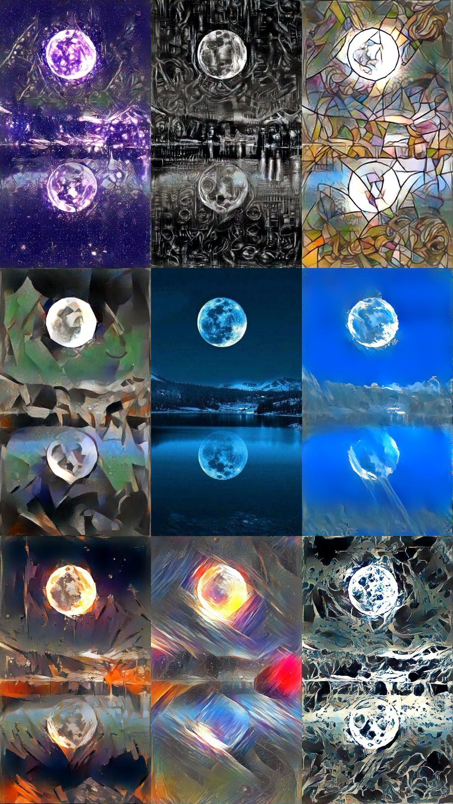
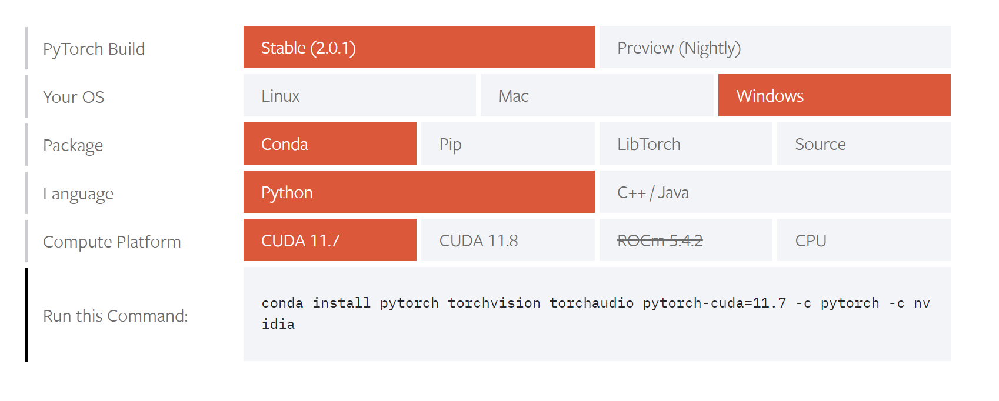
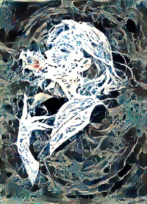

## •Team Introduction 
202011267 김승찬 (indiviual, team num 8) 
## •Topic Introduction 
Neural Style Transfer(화풍을 바꾸는 머닝 러싱) 
그림체를 바꾸고 싶은 그림과 바꿀 그림체를 선택하고 실행시킵니다. 
그러면 당신이 고른 그림체를 학습하여 화풍이 바뀐 새로운 그림이 나올 겁니다. 
#### 참조 repository :  https://github.com/gordicaleksa/pytorch-neural-style-transfer 
## •Results 

### input

  
  

### output
 

 
 

## •Analysis/Visualization  

###### 이 항목에서 화풍이란 style img의 그림체와 색감의 조합을 의미합니다. output img란 style img의 화풍으로 content img를 다시 그린 그림입니다. 각 항목의 첫 번째 두 번쨰 사진은 각각 content img, style img입니다. 그 외 6개의 사진은 content img, style img의 output img입니다. 각 수치의 기본 값들은 (height =400, content weight=1e5, style weight=3e4, tv weight=1e0) 입니다.  별도로 명시하지 않은 값들을 제외한 나머지는 기본 값들을 가지고 있습니다. 
 

우선 본문에서 다룰 해당 머닝 러신에서의 변수는 총 4가지 있습니다. 
1. height
2. content weight
3. style weight
4. tv weight (total variation loss weight) 

이 네 변수에 변동을 주며 output img를 분석하겠습니다.

### height
우선 살펴볼 이미지는 height 수치입니다. height는 간단히 말하자면 화질입니다. 

 

 

######  (왼쪽 위 부터 오른쪽으로 각 각 height = 50, 100, 200, 400, 800, 1200)
위 output img 이미지 들은 각 height 수치에 변동을 준 이미지들 입니다. 

height 수치가 높아질수록 확인되는 점들을 말씀 드리겠습니다. 
 
해상도가 올라갑니다.. 사진을 확대하여 픽셀을 확인한다면 height의 수치가 높을수록 output img를 이루는 픽셀의 크기가 작아지며 촘촘해지는 것이 확인됩니다. 
원본 이미지와의 유사도가 높아집니다. height 수치가 낮은 50~200에서의 output img는 뒤쪽의 집은커녕 말도 분간이 힘든 반면 400부터 말과 집의 형태가 육안으로도 쉽게 구분되며 해상도가 높아질수록 낮은 height 수치에서는 발견되지 않은 content img의 세세한 부분이 식별됩니다. 

추가로 height수치가 올라갈수록 output img와는 별도로 프로그램의 실행 시간이 증가하였습니다. 

### content weight

다음 살펴볼 이미지는 content weight수치입니다.  
content weight는 원본 이미지의 색상을 얼마나 유지할지를 정하는 변수입니다. 

 

###### ( 왼쪽 위 부터 오른쪽으로 content weight = 1e0, 1e2, 1e4, 1e6, 1e8, 1e10)
위 output img 이미지들은 각 content weight 수치에 변동을 준 이미지들입니다. 

육안상으로는 (1e0 ~1e4)에서는 각 output img의 차이를 확인하기 어렵습니다. 1e6에서부터 약간의 차이가 보이며, 1e8부터 육안 상의 차이를 쉽게 확인할수 있으며 1e10은 원본과 유사한 색상을 가지고 있습니다. 
(1e0 ~1e4)에서 차이가 확인되지 않은 이유는 비록 1e2씩 커져서 1e4까지 커지지만 수치가 style weight의 기본 값인 3e4에 비해 낮은 수치이기 때문에, 비교하여도 큰 차이가 나지 않아서 그런 것 같습니다. 그래서 style weight의 기본값을 넘어서는 1e6부터는 육안으로도 차이가 확인되었습니다. 

### style weight

다음 살펴볼 이미지는 style weight 수치입니다. 
style weight는 style img의 화풍이 output에 영향을 얼마나 끼칠지를 정하는 변수입니다. 

 

 

###### ( 왼쪽 위 부터 오른쪽으로 style weight = 3e0, 3e2, 3e4, 3e6, 3e8, 3e10)
위 output img 이미지들은 각 style weight 수치에 변동을 준 이미지들입니다. 
먼저 수치와 상관없이 처음 사진부터 content img와 차이가 보입니다. 하지만 화풍에 영향을 준 것이 아닌 색상만 바뀌었을 뿐 그림체에는 영향을 거의 주지 않았습니다. 
하지만 3e2부터 그림체가 급격히 바뀌더니 3e4~3e10부터 육안으로는 구분 안 될 정도의 유사한 화풍을 가지게 되었습니다. 
content weight인 1e5에 근접하는 3e4부터 그 이후의 값들은 유사한 output img가 나왔습니다.

### tv weight (total variation loss weight) 

먼저 tv weight을 설명드리겠습니다. total variation loss weight를 간단히 설명드리자면 "content img가 유지되는 영향의 정도"입니다.
tv weight의 수치가 높을수록 content img에 가까운 이미지가 나옵니다. 추가로 tv weight가 output 그림체의 부드러움(선명도)도 영향을 끼칩니다. 

 

 

###### ( 왼쪽 위 부터 오른쪽으로 tv weight = 1e0, 1e2, 1e4, 1e6, 1e8, 1e10)
위 output img 이미지들은 각 tv weight 수치에 변동을 준 이미지들입니다. 
tv weight 수치가 높아질수록 style img의 화풍이 끼치는 영향이 낮아지고 있는 것이 육안으로 확인됩니다. 
tv weight 수치가 낮은 1e0, 1e2는 style img의 영향이 크게 끼치지만, 1e4, 1e6부터 style img의 영향이 점차 사라지며 content img의 영향이 커지며, tv weight가 높은 1e8, 1e10은 style img의 영향이 육안으로는 거의 확인되지 않습니다. 
추가로 tv weight 수치가 높아질수록 output의 그림체의 선명도가 낮아지는 것이 확인됩니다. 
tv weight가 일정 수치(1e8)을 넘어갈 시 유사한 output img가 나왔습니다.

### 정리

1. height 수치가 높을수록 output img의 해상도가 올라간다.
2. content weight 수치가 style weight에 비해 낮을수록 style contnt 화풍의 영향이 output img에 낮게 미치며, 높을수록 높게 미친다.
3. output img의 색감에 미치는 영향은 style weight 수치의 높낮이와 상관이 없다.
4. output img의 그림체는 style weight가 높을수록 영향이 강해지며, content style의 근접하거나, 일정 수치가 넘어갈 시 유사한 output img가 나온다.
5. tv weight 수치가 높아질수록 style weight의 화풍이 output img에가 끼치는 영향이 낮아진다.
6. tv weight 수치가 높아질수록 output img의 그림체의 선명도가 낮아진다.

다음은 제가 애용하는 배경화면에 8가지 style img를 넣은 사진입니다. 
 
가운데 있는 사진이 원본입니다. 만약 여러분들도 이 repository에 관심이 있다면 좋아하는 사진에 여러가지 style img를 넣어 repository를 실행시켜 보세요.

## •Installation 

### test enviroment 
os: window 11 64 bit 
processer: AMD Ryzen 5 5600H with Radeon Graphics 

anaconda, pytorch, python이 필요합니다. 
python에 다음과 같은 것들이 install되어 있어야합니다. (pip install <b> numpy, pip, matplotlib, torchvision, pytorch, opencv-python</b>)  
자세한 것은 environment.yml을 참조하세요 
이 repository이 clone되어 있어야 합니다. 

### anaconda 설치법
다음 공식 홈페이지에서 다운 받을수 있습니다 (https://www.anaconda.com/download/) 
1.다운받은 파일을 실행합니다. 
2.동의 후 사용자를 선택해줍니다. 
3. 설치 경로를 지정해줍니다. 이 때 3.0GB 용량이 필요합니다. 
4. 설치가 시작고 끝난 후 finish를 눌러줍니다. 

### pytorch 설치법
1. 다음 홈페이지에서 자신에게 맞는 환경을 선택합니다.(https://pytorch.org/get-started/locally/) 
2. 저의 환경에서는 아래의 옵션을 선택했습니다..   
당신은 당신에게 맞는 환경을 선택하신 후 홈페이지에서 가르켜준 코드를 실행하면 됩니다. 
  

### Setup
  1. Anaconda Prompt를 실행하고 프로젝트 파일의 위치로 이동합니다. `cd path_to_repo` 
  2. `conda env create`를 실행합니다. (파일의 위치에 있는 동안) 
  3. `activate pytorch-nst`를 실행합니다. 
### Usage
  1. `/data/content-images/`에 바꾸고자 하는 그림의 content image 이미지를 저장시킵니다. 
  2. `/data/style-images/`에 선택하고 싶은 그림체의 style images 이미지를 저장시킵니다. 
  3. 명령 프롬포트 또는 Anaconda Prompt를 실행 후 프로젝트 파일로 이동 후  `python neural_style_transfer.py --content_img_name <content-img파일 이름> --style_img_name <style-img파일 이름>` 을 실행합니다. 
  ex) a01.jpg, v5.png 선택 시: `python neural_style_transfer.py --content_img_name a01.jpg --style_img_name v5.png`  
  위 ex)코드를 성공적으로 실행시켰고 기다리면 아래 이미지와 유사한 이미지가 `/data/output-images`에 저장될것입니다. 
  
   
  이제 여러 그림을 선택하고 실행하여 만들고 싶은 이미지를 만드시면 됩니다. 
  
## •Presentation
https://youtube.com/watch?v=YXFwjPDneGU&feature=share9
